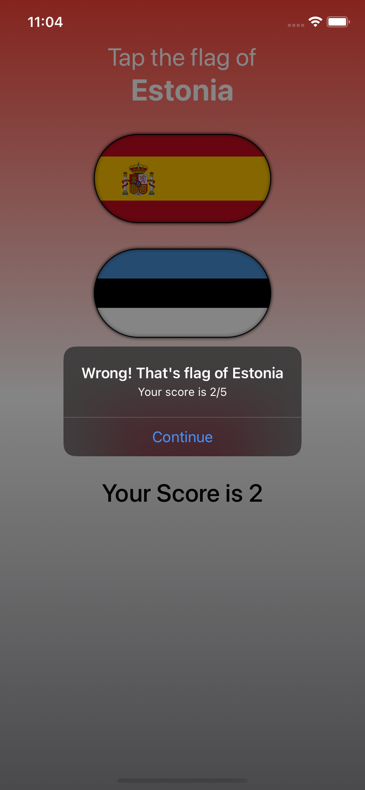
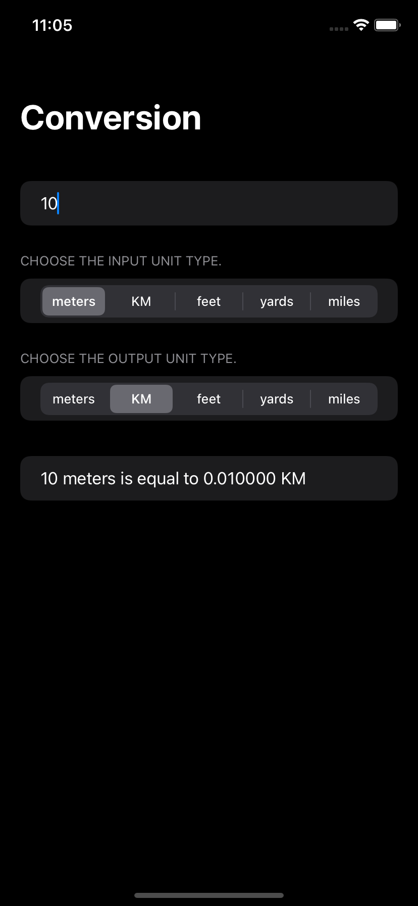
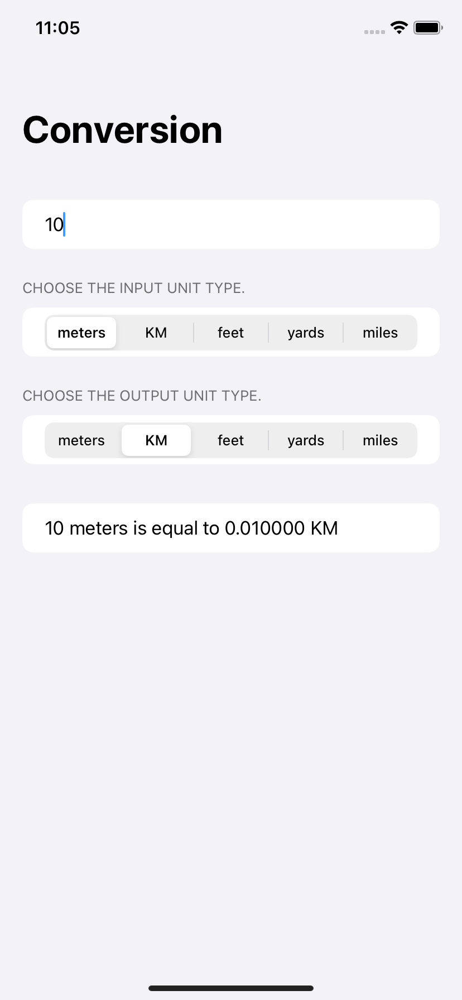
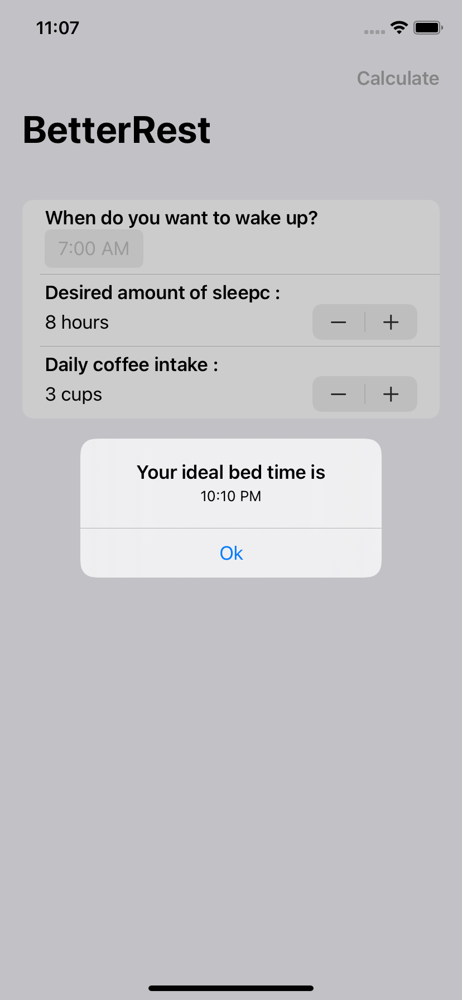
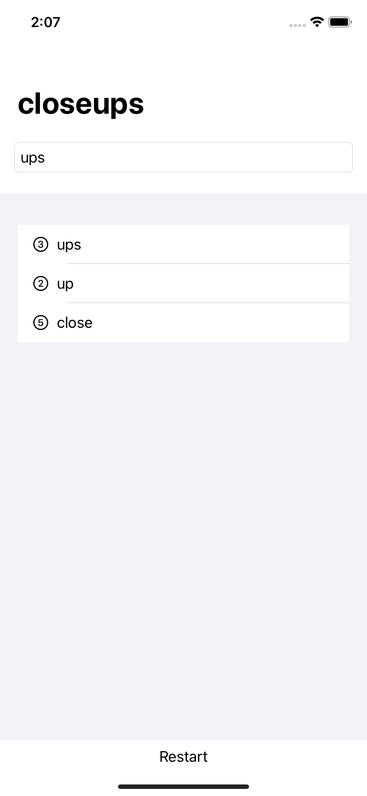

# 100DaysOfSwiftUI

* 100 Days Of SwiftUI by Paul Hundson

## Projects List
1. WeSplit
   |     
2. LenghtConversion
   |     
3. GuessTheFlag
   |     
4. ViewsAndModifiers
      
5. BetterRest
   |     
6. WordScramble
   |     

## Inroduction to Swift
- [X] day 1-15

## Starting SwiftUI
- [X] day 16
- [X] day 17
- [X] day 18
- [X] day 19
- [X] day 20
- [X] day 21
- [X] day 22
- [X] day 23
- [X] day 24
- [X] day 25
- [X] day 26
- [X] day 27
- [X] day 28
- [X] day 29
- [X] day 30
- [X] day 31
- [X] day 32
- [ ] day 33
- [ ] day 34
- [ ] day 35
